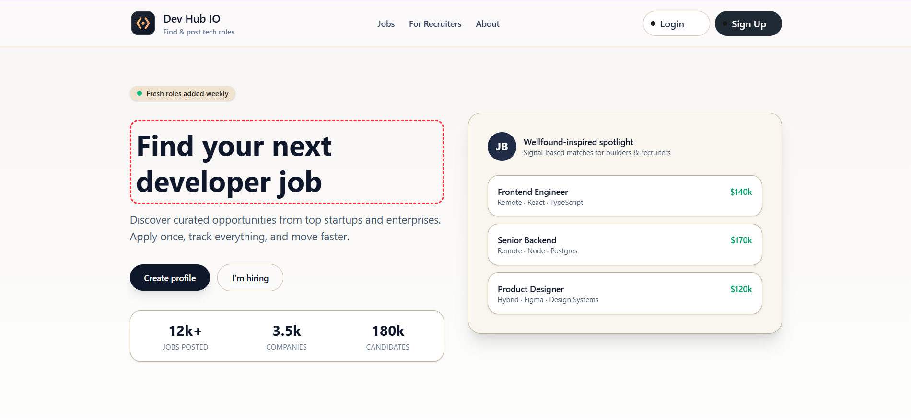

# DevHubIO — Job Board Platform

Full-stack job board with recruiter + job seeker flows, modern UI, and a clean backend architecture. Built to showcase real-world product thinking: fast onboarding, curated roles, and structured hiring pipelines.



## Highlights

- Recruiter + job seeker roles (JWT auth)
- Profile completion flow
- Job creation and job listings (backend + UI)
- Structured backend layers (Controller → Service → Repository)
- Responsive UI with Tailwind, Radix, and Motion

## Tech Stack

**Frontend**

- React 19, Vite, Redux Toolkit
- Tailwind CSS, Radix UI, Lucide Icons
- React Router, React Hot Toast

**Backend**

- Node.js, Express, MongoDB (Mongoose)
- JWT auth, express-validator, rate limiting

## Project Structure

```
frontend (root)
├── src/        # React UI, routes, Redux slices
└── public/     # Static assets + poster

backend/
├── src/        # API (controllers/services/repositories)
└── .env        # Server environment variables
```

## Getting Started

### Frontend

```
npm install
npm run dev
```

Runs at http://localhost:5173

### Backend

```
cd backend
npm install
npm run dev
```

Runs at http://localhost:5000

### Backend Environment Variables

Create `backend/.env`:

```
PORT=5000
MONGODB_URI=mongodb://localhost:27017/job_board
JWT_SECRET=change_me
JWT_EXPIRE=7d
FRONTEND_URL=http://localhost:5173
```

## API Overview (current)

- `POST /api/auth/signup` — create account
- `POST /api/auth/login` — login
- `GET /api/profile/me` — fetch profile (auth)
- `PUT /api/profile/me` — update profile (auth)
- `POST /api/jobs` — recruiter creates job (auth)
- `PATCH /api/jobs/:jobId` — recruiter updates job (auth)
- `GET /api/jobs` — job seeker list (auth)
- `GET /api/jobs/recruiter` — recruiter job list (auth)

## Current Status

**In progress** — core UX and backend scaffolding are in place, with auth/profile/jobs working. Applications and job search filters are next.

## What’s Left (Near-Term)

- Pagination + filtering for job listings
- Applications flow (apply, recruiter list, status updates)
- Public job listing (no auth) for landing/search
- Cleaner recruiter dashboard (job metrics + applicants)

## Future Polishing Ideas

- Password reset + email verification
- Golang email service (learning project)
- Full recruiter analytics dashboard
- Job alerts + saved searches
- CI + test coverage

## Scripts

Frontend:

- `npm run dev`
- `npm run build`
- `npm run preview`

Backend:

- `npm run dev`
- `npm start`

## Author

Built by **Sameer Sheikh**.
