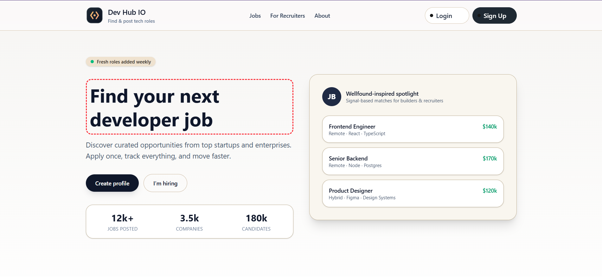

# DevHubIO — Job Board Platform

Full-stack job board with recruiter + job seeker flows, modern UI, and a clean backend architecture. Built to showcase real-world product thinking: fast onboarding, curated roles, and structured hiring pipelines.



---

## 🚀 Still Need To Implement

**Core Features (Priority)**

- Email notifications (password reset, application status updates, job alerts)
- Email verification on signup
- Password reset functionality
- Job alerts and saved searches
- Advanced filtering (salary range, company filtering, years of experience)
- Full-text search with relevance scoring
- Recruiter analytics dashboard with detailed metrics
- Interview stage management
- Bulk job operations (import/export CSV)

**Nice to Have (Polish)**

- Dark mode theme support
- User preferences and notification settings
- Resume parsing and auto-fill
- Candidate evaluation scoring
- Admin dashboard with platform analytics
- SMS notifications

---

## ✅ What's Working

### Core Flows ⭐

- **Applications flow** - Apply to jobs, track status (applied/reviewed/accepted/rejected), recruiter receives applications
- **Cleaner recruiter dashboard** - Job metrics + applicants list with full management capabilities

### Authentication & Profiles

- User signup/login with JWT authentication (stateless, ready for scaling)
- Role-based access (job seeker vs recruiter)
- Profile creation and editing with skill management
- Profile onboarding flow for new users

### Job Listings & Browsing

- Job creation by recruiters with full details (title, description, salary, location, skills, etc.)
- Search jobs with text search functionality
- Filter jobs by: location (remote/hybrid/onsite), employment type (full-time/part-time/contract/internship), experience level (fresher/junior/mid/senior/lead)
- Sort jobs by: newest, oldest, salary (high to low, low to high)
- Pagination with URL state management (page persists when navigating back)
- Responsive job cards with job details, salary, location, and company info
- Job details page with full job information and application status checking
- "Already Applied" indicator when viewing jobs user has applied to

### Applications Tracking

- Job seekers can apply to jobs (with duplicate prevention)
- Applied jobs section in user profile with status tracking (applied/reviewed/accepted/rejected)
- Filter applied jobs by status
- Sort applied jobs by recent/oldest
- Application count and statistics
- Job details viewable from applied jobs 

### Recruiter Features

- Recruiter dashboard with job creation form
- List of posted jobs with filters and sorting
- Job status management (ACTIVE, DRAFT, CLOSED) [still need to impliment]
- Job statistics (total posted, active, draft, closed)
- Sort recruiter jobs by: newest, oldest, most applicants, least applicants
- View applicants for each job [still need to impliment]

### Frontend Architecture

- Redux Toolkit for state management with async thunks
- React Router with URL-based filtering and pagination
- Component memoization to prevent unnecessary re-renders
- Tailwind CSS + Radix UI for modern, accessible UI
- React Hot Toast for user notifications
- Responsive design (mobile, tablet, desktop)

### Backend Architecture

- 3-layer clean architecture (Controller → Service → Repository)
- Express middleware: authentication, validation, rate limiting, error handling
- MongoDB with Mongoose ODM
- Proper pagination with skip/limit
- Input sanitization for XSS prevention
- JWT token-based stateless authentication
- Optional authentication support for job details (users see their application status)

---

## 🎯 Future Polishing Ideas

- Password reset + email verification
- Golang email service (learning project)
- Full recruiter analytics dashboard
- Job alerts + saved searches
- CI + test coverage

---

## Highlights

- Recruiter + job seeker roles (JWT auth)
- Profile completion flow
- Job creation and job listings (backend + UI)
- Structured backend layers (Controller → Service → Repository)
- Responsive UI with Tailwind, Radix, and Motion

## Tech Stack

**Frontend**

- React 19, Vite, Redux Toolkit
- Tailwind CSS, Radix UI, Lucide Icons
- React Router, React Hot Toast

**Backend**

- Node.js, Express, MongoDB (Mongoose)
- JWT auth, express-validator, rate limiting

## Project Structure

```
frontend (root)
├── src/        # React UI, routes, Redux slices
└── public/     # Static assets + poster

backend/
├── src/        # API (controllers/services/repositories)
└── .env        # Server environment variables
```

## Getting Started

### Frontend

```
npm install
npm run dev
```

Runs at http://localhost:5173

### Backend

```
cd backend
npm install
npm run dev
```

Runs at http://localhost:5000

### Backend Environment Variables

Create `backend/.env`:

```
PORT=5000
MONGODB_URI=mongodb://localhost:27017/job_board
JWT_SECRET=change_me
JWT_EXPIRE=7d
FRONTEND_URL=http://localhost:5173
```

## API Overview (current)

- `POST /api/auth/signup` — create account
- `POST /api/auth/login` — login
- `GET /api/profile/me` — fetch profile (auth)
- `PUT /api/profile/me` — update profile (auth)
- `POST /api/jobs` — recruiter creates job (auth)
- `PATCH /api/jobs/:jobId` — recruiter updates job (auth)
- `GET /api/jobs` — job seeker list (auth)
- `GET /api/jobs/recruiter` — recruiter job list (auth)

## API Overview (Current)

**Authentication**

- `POST /api/auth/signup` — create account
- `POST /api/auth/login` — login

**Profile**

- `GET /api/profile/me` — fetch profile (auth)
- `PUT /api/profile/me` — update profile (auth)

**Jobs (Listing)**

- `GET /api/jobs` — list all jobs with filters/pagination (auth)
- `GET /api/jobs/:jobId` — get job details (auth)

**Jobs (Recruiter)**

- `POST /api/jobs` — recruiter creates job (auth)
- `PUT /api/jobs/:jobId` — recruiter updates job (auth)
- `DELETE /api/jobs/:jobId` — recruiter deletes job (auth)
- `GET /api/jobs/recruiter` — recruiter's job list (auth)

**Applications**

- `POST /api/applications/:jobId` — apply to job (auth)
- `GET /api/applications` — get user applications (auth)
- `GET /api/applications/recruiter` — get recruiter applications (auth)

## Key Features Implemented Correctly

✅ **URL-Based State Management**: Filters, sorting, and pagination are saved in URL. Users can share filtered job lists and return to the same filters when navigating back.

✅ **No Unnecessary Re-renders**: Components use React's memoization and Redux selectors to prevent unnecessary re-renders when changing pages, filters, or sorting.

✅ **Pagination**: Both job listings (25 per page, max 50) and application lists support proper pagination with page count calculation.

✅ **Filter + Pagination**: When filters change, pagination resets to page 1. When sort changes, page resets to 1. This prevents edge cases like requesting page 10 with filters that return only 2 pages.

✅ **Clean Architecture**: Backend follows Controller → Service → Repository pattern, making code easy to test and maintain.

✅ **Security**: Input sanitization, XSS prevention, JWT authentication, rate limiting on auth endpoints.

## Current Status

**Ready for deployment** — all core features are functional and production-ready. Cleanup complete (no debug logs, TODO comments removed).

## Deployment Notes

Before pushing to Vercel (Frontend) and Render (Backend):

1. ✅ All console.log statements removed
2. ✅ All TODO/FIXME comments removed for production
3. ✅ No exposed credentials in code (use environment variables)
4. ✅ Security headers configured (Helmet middleware)
5. ✅ CORS configured for production URLs
6. Add proper monitoring and error tracking in production

## Next Steps for Implementation

Refer to **"Still Need To Implement"** section at the top of this README for prioritized features.

**Quick Start:**

1. Build public job listing page (no auth required)
2. Add email notifications service
3. Implement password reset + email verification
4. Build recruiter analytics dashboard
5. Add advanced search with relevance scoring
6. Setup CI/CD pipeline with tests

## Author

Built by **Sameer Sheikh** - showcasing modern full-stack architecture, clean code practices, and product thinking.
